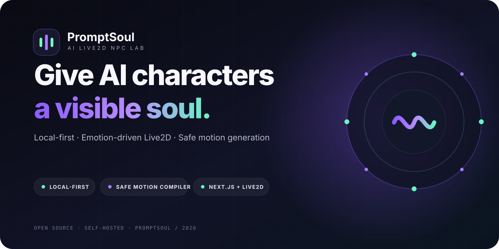

<p align="center">
  
</p>

# PromptSoul

[简体中文](README.md) · English · [日本語](README.ja.md)

> The [Chinese README](README.md) is the canonical, complete reference. This English document is a maintained overview; follow the Chinese document if wording differs.

PromptSoul is a local-first, self-hosted AI Live2D NPC prototype. A Next.js server streams a character reply and emotion label, the browser maps the emotion to a Live2D motion, and a Japanese-oriented segmenter sends the readable copy of the assistant's original reply to the local AivisSpeech Engine. Real Web Audio amplitude drives runtime lip sync. The Motion Workshop still compiles natural-language prompts into strictly constrained actions supported by the current model.

> The AI never edits meshes, rigging, or Cubism bindings. Generated actions may use only existing model parameters and may be registered only in the project-owned `PromptSoul` motion group.

**Start here:** [Quick start](#quick-start) · [AI Provider](#ai-provider) · [Character voice](#character-voice) · [Prompt-to-motion](#prompt-to-motion-generation) · [Use another model](#using-another-live2d-model) · [Security](#contributing-and-security)

<sub>Demo character: Hiyori Momose ©Live2D. Model data is not included in this repository.</sub>

> This content uses sample data owned and copyrighted by Live2D Inc. The sample data are utilized in accordance with terms and conditions set by Live2D Inc. This content itself is created at the author’s sole discretion.

## Project status

PromptSoul is an experimental local development prototype. It has no accounts, tenant isolation, public-network authentication, or rate limiting. The server binds to `127.0.0.1`; do not expose it directly to the public internet.

## Quick start

Requirements: a supported Node.js 22+ release, npm, a modern browser, and network access. Python is not required. The page loads Live2D Cubism Core, PixiJS, and `pixi-live2d-display` from pinned CDN resources.

Before downloading the Hiyori demo, read the [Live2D Free Material License Agreement](https://www.live2d.com/eula/live2d-free-material-license-agreement_en.html) and [Live2D Cubism Sample Data Terms of Use](https://www.live2d.com/en/learn/sample/model-terms/). Run the setup command only if you agree.

```bash
npm ci

# First use only: explicitly confirm that you accept the linked terms.
npm run setup:demo -- --accept-license
npm run motions:generate
npm run motions:validate

npm run dev
```

Open <http://127.0.0.1:8765>. Without an API Key, chat uses deterministic local demo replies. If AivisSpeech is offline, text chat, Live2D, existing actions, and interactions remain available. The Motion Workshop requires an AI Provider.

For a production build on a trusted self-hosted machine:

```bash
npm run build
npm start
```

PromptSoul reads and writes a local model working copy, generated motion definitions, and a bounded local audio cache. It is not designed for Edge or ephemeral Serverless runtimes.

## AI Provider

The top-right settings panel is read-only and shows the current OpenAI-compatible server configuration. Normal NPC chat uses `@aituber-onair/chat`; motion generation retains PromptSoul's bounded non-streaming transport and independent safety compiler.

- The LLM Key is read only from the Node server environment and is never sent to the browser.
- The Key is never written to React state, browser storage, cookies, config files, logs, responses, or Git.
- Remote Providers must use HTTPS; HTTP is accepted only for loopback services.
- Character persona, chat content, and motion prompts are sent to the Provider you configure.
- Live2D model files, raw parameter IDs, generated curves, and local paths are not sent to the Provider.

For long-running local deployments, export server environment variables from the launch shell:

```bash
export NPC_API_KEY="your API Key"
export NPC_API_BASE="https://api.openai.com/v1"
export NPC_MODEL="gpt-5.6-luna"
npm run dev
```

`NPC_API_KEY` takes precedence over `OPENAI_API_KEY`. Restart PromptSoul after changing server environment variables.

For production, run `npm run build` before `npm start`, as shown in [Quick start](#quick-start).

`gpt-5.6-luna` is PromptSoul's current default Provider model name and is not available from every OpenAI-compatible service. Select a model actually supported by your Provider if it returns a model-not-found error.

## Character voice

Character voice uses only the local [AivisSpeech Engine](https://github.com/Aivis-Project/AivisSpeech-Engine) at `127.0.0.1:10101`; it needs no cloud TTS Key. Install and start AivisSpeech, import the コハク model yourself, and confirm the あまあま style exists. Model files are not included or downloaded by PromptSoul, and you are responsible for the selected voice model's license.

Do not set `speaker=1`: the style ID shown inside the model is local to that model. AivisSpeech creates a dynamic global Style ID for its HTTP API. PromptSoul calls `/speakers`, matches the configured UUID/name plus style name, and verifies any explicitly configured ID before using `/audio_query` and `/synthesis`.

```bash
# Merge the Aivis variables from .env.example into your existing .env.local.
npm run tts:check          # prints the resolved global Style ID
npm run tts:smoke          # writes an ignored artifacts/tts-smoke.wav
npm run dev
```

The public server boundary is `GET /api/tts/status`, `GET /api/tts/voices`, and `POST /api/tts`; the existing `GET /api/status` also includes a `tts` field. The browser calls only same-origin routes. The Engine URL remains server-only and cannot be supplied by a client.

The segmenter is optimized for Japanese punctuation; it does not detect languages or translate replies. The default persona asks the Provider to answer in the user's language, so use Japanese input or adjust the persona if Japanese speech is required. The original text displayed in chat is never rewritten for TTS.

One ordered `AudioContext` queue plays each phrase through `AudioBufferSourceNode → AnalyserNode → GainNode → AudioContext.destination`; the gain node also feeds a `MediaStreamAudioDestinationNode` used by the recorder. Noise-gated, smoothed real RMS drives only runtime mouth parameters during the proven legacy renderer's `beforeModelUpdate` hook. Lip sync prefers the model's `LipSync` group (Hiyori uses `ParamMouthOpenY`). A TTS failure skips audio without interrupting text chat or emotion motions.

The bounded local WAV cache contains synthesized conversation audio. On a shared device or for sensitive conversations, set `TTS_CACHE_ENABLED=false`; stop PromptSoul and remove `.cache/aivis-tts/` to purge existing entries.

The top-right local voice panel shows Engine/voice/style readiness, the real global Style ID, installed voices, preview, stop, queue state, and the last error. See the complete [Chinese README](README.md#接入角色语音) for every environment variable, troubleshooting, cache behavior, and the unattended recording contract.

For a focused unattended TTS/lip-sync proof clip, install Chrome/Chromium, ffmpeg, ffprobe, Bash, `curl`, and `seq` on macOS, Linux, or WSL, then run:

```bash
npm run record:browser
```

The recorder starts Next.js, opens a separate headless Chrome instance with the project's SwiftShader/background-rendering flags, calls `PromptSoulTTS.play()` directly, captures CDP frames plus the queue's `MediaStreamAudioDestinationNode`, and encodes them together. It does **not** send a chat message or exercise the LLM stream.

Before recording, it requires TTS state `playing`, a running `AudioContext`, advancing playback time, non-silent RMS, and a nonzero Live2D mouth-parameter readback. That proves the real audio-to-runtime-parameter path, but it does not independently compare ArtMesh vertices or prove that a gesture is visually obvious. The final checks use ffprobe and verify that three temporary extracted JPEGs are nonempty; they are not semantic visual inspection and are deleted with the temporary working directory. Review the resulting video manually.

The default output is `artifacts/promptsoul-unattended.mp4` at 720×1280. Override it with `OUT`, `WIDTH`, `HEIGHT`, `PORT`, `CHROME`, `FFMPEG`, `FFPROBE`, `TTS_TEXT`, or `RECORD_TIMEOUT_MS`; equivalent CLI flags are available via `npm run record:browser -- --help`. The command fails rather than silently continuing when AivisSpeech, the configured voice, real audio playback, or mouth-parameter variation cannot be proven.

## Prompt-to-motion generation

After a Provider and model are available, describe an action such as “look surprised, lean back, then nod and return to the starting pose.” The server:

1. derives safe parameter ranges, base poses, and physics outputs from the current model;
2. sends the Provider only opaque controls, semantic labels, and normalized values;
3. rejects unknown fields, arbitrary code, physics outputs, `PartOpacity`, out-of-range values, invalid keyframes, and curves that do not return to the base pose;
4. writes atomically and updates only the `PromptSoul` group;
5. reloads the model and previews the generated action.

Persisted AI actions use server-owned `promptsoul_ai_<12-hex>` IDs. Only validated generated actions with that exact form show a delete control. A successful delete can report `cleanupPending` if an ignored generated definition still needs manual cleanup. Built-in actions and model-owned groups such as `Action`, `Idle`, and `Tap` cannot be deleted from the UI. The seven built-in emotion actions documented in this repository are specific to the current Hiyori definition; another model may expose a different safe set.

If the current model cannot express a request naturally and safely, the API returns `motion_not_feasible` instead of forcing unsupported parameters.

## Using another Live2D model

The ZIP or directory must contain a Cubism 4 `*.model3.json` file and every referenced texture, `.moc3`, physics, and motion resource.

```bash
npm run setup:model -- /path/to/model-folder-or.zip
npm run analyze:model
```

Always inspect the analysis before creating `motion-defs/<model-name>.ts`. Hiyori parameter values are examples, not a template for another rig.

```bash
npm run motions:generate
npm run motions:validate
npm run verify:browser
npm run dev
```

Update `npc.config.json` and `modelAttribution` when replacing the character so every stage, screenshot, and demo retains the attribution required by that model's license.

## Repository layout

```text
app/                         Next.js pages and Node Route Handlers
components/                  React status and local AivisSpeech diagnostics UI
components/legacy-runtime.tsx loads the pinned SDKs and proven browser runtime
assets/app.js                single Live2D controller, chat/TTS wiring, lip sync
assets/                      remaining responsive styles and browser assets
lib/server/aivis-*.ts        AivisSpeech client, voice resolution, bounded cache
lib/shared/browser-tts.ts    Japanese-oriented segmentation and Web Audio queue
lib/server/                  chat Provider plus model and motion safety
scripts/                     Node/TypeScript CLI and unattended CDP recording
tests-node/                  node:test suites
motion-defs/<model>.ts       Model-specific built-in motion definitions
motion-defs/generated/       Ignored local AI motion specifications
npc.config.json              Character, greeting, suggestions, and attribution
model.config.json            Ignored active-model pointer generated locally
local-assets/ , models/      Ignored licensed/generated model data
```

## Verification

Model-independent checks:

```bash
npm run verify
git diff --check
```

For model, motion, or visual changes, also run:

```bash
npm run motions:generate
npm run motions:validate
npm run verify:browser
```

Inspect real rendered poses and both desktop and 390×844 layouts. A base-pose-only screenshot means playback failed.

`npm run verify:browser` requires Chrome, Bash, `curl`, and `seq`, and is intended for macOS, Linux, or WSL. Set `CHROME=/path/to/chrome` when Chrome is not installed at the default macOS path.

## Contributing and security

Read [CONTRIBUTING.md](CONTRIBUTING.md) before opening a pull request and follow the [Code of Conduct](CODE_OF_CONDUCT.md). Report vulnerabilities privately according to [SECURITY.md](SECURITY.md); never include a real API Key, private Live2D/AIVMX model, generated WAV, recording, or restricted asset in a public report.

## License and upstream

Code and documentation that the copyright holders are entitled to license are available under the [MIT License](LICENSE). This does not license Hiyori, Live2D Cubism Core, AivisSpeech, AIVMX voice models, user-supplied models, or other third-party assets. Do not modify Hiyori's character design. Every screenshot or demo containing Hiyori must visibly retain `Hiyori Momose ©Live2D` and the statement required by the applicable Live2D terms.

Live2D Cubism Core remains subject to the [Live2D Proprietary Software License](https://www.live2d.com/eula/live2d-proprietary-software-license-agreement_en.html). AivisSpeech Engine is not bundled and is distributed upstream under [GNU LGPL v3](https://github.com/Aivis-Project/AivisSpeech-Engine/blob/master/LICENSE); each AIVMX voice model may use a different license. Users must inspect and follow the selected model's terms. PromptSoul does not relicense a model author's work. See [THIRD_PARTY_NOTICES.md](THIRD_PARTY_NOTICES.md) for the complete boundary.

PromptSoul extends [shinshin86/live2d-add-motion-sample-web-ui](https://github.com/shinshin86/live2d-add-motion-sample-web-ui), which demonstrated how to add motions to existing Live2D parameters through JSON without opening Cubism Editor. The upstream MIT copyright notice remains in this repository.
